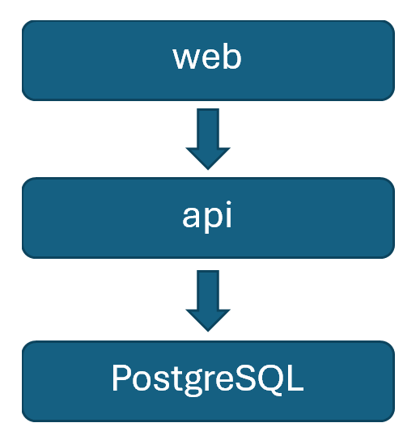

# Demo of Java Enhancement for azd 

## 0. Intro 

I am excited to introduce the recent enhancements we have made to the `azd` tool. These improvements enable Java 
developers to bring their applications to Azure quicker than ever.

## 1. azd’s current experience of current existing project and recap its key problem 

Let's start with an existing project that is based on the Java todo project. This project uses a PostgreSQL database as 
the backing store for the todo items created in the application. Here is the system diagram of the todo project:

> 

Let's start by running `azd init` in this repository. As you can see, the PostgreSQL database is missing. To ensure that
the application can run, users will need to update the bicep files to create PostgreSQL, and they also need to figure 
out the endpoint of the backend (api) to call from the frontend (web).

## 2. Show azd Enhancement for Java experience for the same project 

Now, let's move on to the Java enhancements we have made to azd. We will use `azd init` to generate the improved 
azure.yaml. This new format of azure.yaml describes the services, the service bindings, and the Azure resources. After 
that, we will call `azd up` to provision the resources and deploy the services.

Steps: 

   1. Run `azd init` to generate the azure.yaml.
   2. Show and explain azure.yaml.
   3. Run `azd up`.

## 3. Show it for new project as well

Next, we will demonstrate the ability on a newly created project. We will use VS Code to create a new Java project and 
use the Spring Initializr to select web and Service Bus dependencies. Then, we will run `azd init` and `azd up`.

Steps:

   1. VS code -> Java: new project -> Spring boot -> selected dependencies (web app with service bus)
   2. Run `azd init` & `azd up`.

## 4. Recap its advantage

To wrap up, the enhancements to the `azd` tool significantly streamline the process of analyzing, provisioning, and 
deploying Java applications to Azure. 

| Feature   | Feature Description                                                                                                                                                          | 
|-----------|------------------------------------------------------------------------------------------------------------------------------------------------------------------------------|
| Detection | Make sure required Azure Service (like Azure Database for PostgreSQL) can be **detected** by analyzing project files (like pom.xml, application.yml, Java codes).            | 
| Provision | Make sure required Azure service be **provisioned**.                                                                                                                         | 
| Usage     | Make sure required Azure service (like Azure Database for PostgreSQL) can be **used** (connected) in customer's app deployed in compute service (like Azure Container Apps). | 

These improvements save time, reduce complexity, and ensure a more efficient workflow. Thank you for watching, and I 
look forward to seeing how you leverage these enhancements in your projects.